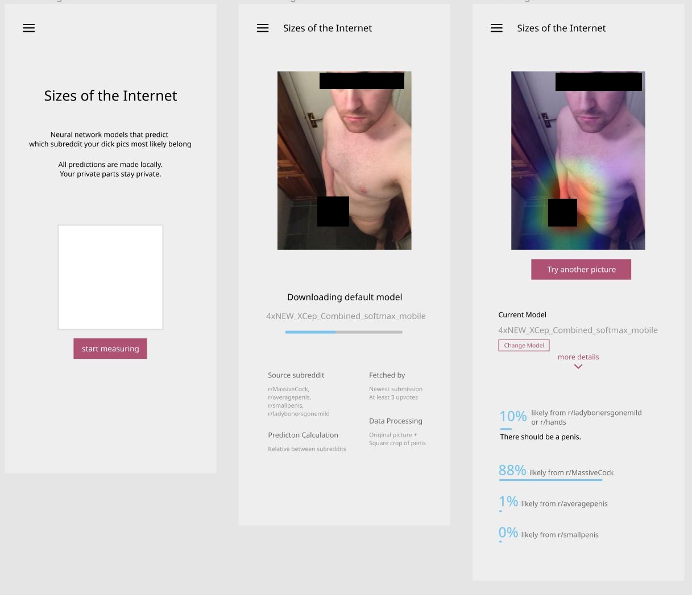
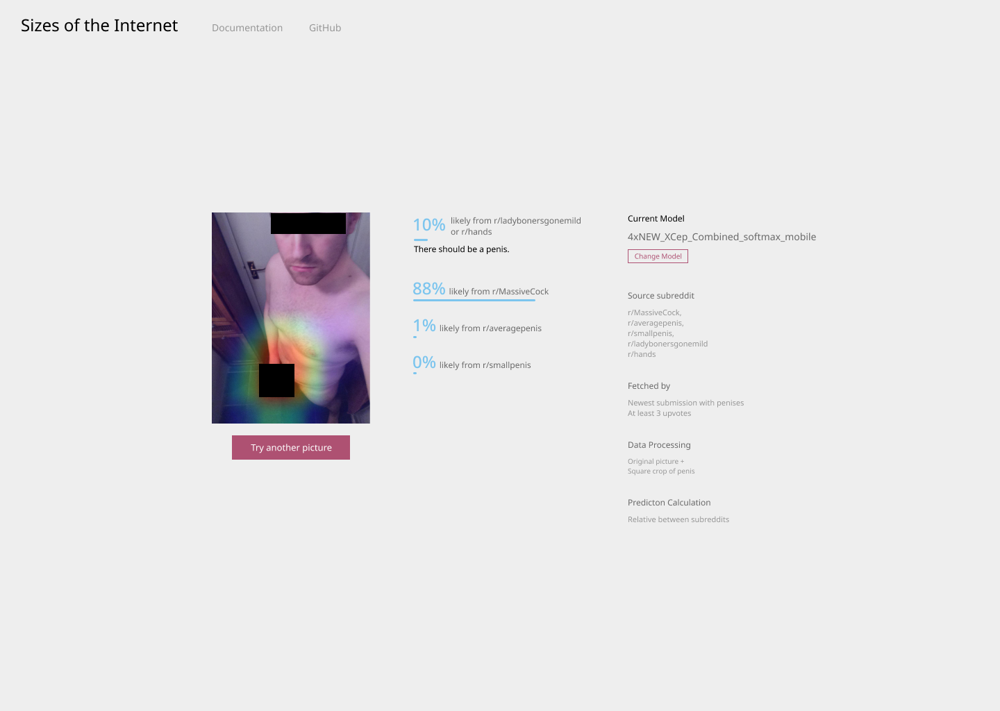

# Prototype and Technical Documentation
The document serves as a reference of future iteration and attempts regarding studying penis size conception in Reddit communities with deep learning.
The following contains information on
-	A Figma mockup of a visioned prototype
-	A website with one of the trained models as a more accessible demonstration
-	Files, both in this repository and external sources.
-	The dataset collected.
-	How each model is trained and their respective source code.
-	Technical notes on transferring models for web deployment

[Model architecture](https://keras.io/examples/vision/image_classification_from_scratch/) and [gradient visualization](https://keras.io/examples/vision/grad_cam/) are based on demostrations from the official Keras documentation. 

---

## Figma Prototype
**WARNING: nudity**

Semi-interactive non-functional prototypes in [mobile](https://www.figma.com/proto/35AmBQPGxdXexShWXB98KF/Mobile?page-id=0%3A1&node-id=2%3A2&viewport=300%2C48%2C0.49&scaling=scale-down&starting-point-node-id=2%3A2&show-proto-sidebar=1) and [desktop](https://www.figma.com/proto/fiTh7eqjaSsoeWcZVrGp4G/Desktop?page-id=0%3A1&node-id=2%3A5&viewport=300%2C48%2C0.58&scaling=scale-down&starting-point-node-id=2%3A5&show-proto-sidebar=1).

The goal of such design is to make the contingency of deep learning models on different dataset trained more accessible to the end user. A simplistic and professional aesthetic aims to create a sense of authority without being authroitative and uninviting. The option to choose a different image as well as changing to another model encorages experimentation within the end user.

---

## Model Demostration in Browser
To demostrate a converted deep learning model running in a browser, the most recently created model is packaged in a barebone [website](https://edinsl.github.io/SM4701/), which is the content in this repository. This demostration only shows predictions from one specific model. Gradient visualization has yet to be implemented. 

---

## Associated files
This repository as mentioned only contains files associated with the web demostration. Due to the file size limit, only one converted model is shown.
The rest of the files, which could be accessed [here](https://portland-my.sharepoint.com/:f:/g/personal/hiuslau5-c_my_cityu_edu_hk/Eogj9_2gFxtOj918hDmexGwBDKyQUOMdAK8f_xekmIRE3w?e=On1J1Z) contains the source code, TensorFlow models, and the entire dataset. 

---

## Dataset Description
[Access link to dataset hosted on OneDrive](https://portland-my.sharepoint.com/:f:/g/personal/hiuslau5-c_my_cityu_edu_hk/Eogj9_2gFxtOj918hDmexGwBDKyQUOMdAK8f_xekmIRE3w?e=On1J1Z)

Data colletion is possible primarily thanks to [DownloaderForReddit](https://github.com/MalloyDelacroix/DownloaderForReddit). Images are first fetched with the downloader, and then inspected for corruption. Folders are named after the subreddit the images are fetched from. 

As there is a hard limit (1000) on how much posts one could query in each feed category (Hot, New, Top (Day, Week, Month, Year, All), etc.), different datasets are therefore created with different method of fetching. Duplicates are avoided with the downloader.

### **Fetch by Top All, and then Top Year**
These include 
-   /averagepenis 
-   /ladybonersgonemild
-   /MassiveCock, /faceandcock 
-   /smallpenis
-   /tinydick 

For penis-related subreddits except /faceandcock and /smallpenis, each has their own related folders with 
-   _withface, 
-   _withhead, and 
-   _withchin 

suffix. The main folder does not contain images that shows the full face, the head, and parts of the head; all of them belong to their respective folders. 

### **Fetch by Top All only**
- /hands

### **Fetch by New, and then Top Month**
- /averagepenis_new
- /MassiveCock_new  
- /tinydick_new

### **Fetch by New, and then Top Month. Minimun of 3 upvotes required**
- /averagepenis_new_min3 
- /MassiveCock_new_min3 
- /smallpenis_new_min3 
- /tinydick_new_min3

### **Fetch by New, and then Top Month, and then Top Year. Minimun of 3 upvotes required**
- /tinydick_new_min3_topY

### **Special Folders**
-   **/cropped**, a spin-off of /averagepenis_new_min3, /MassiveCock_new_min3, and /smallpenis_new_min3_topY where the penis is identified and cropped with the aid of [NudeNet](https://github.com/vladmandic/nudenet). This result in a dataset solely of penises with minimun external features.
-   **/cropped_square**, same as /cropped, except with some programming where it ensures the code would try to crop a square around the penises if possible. 
-   **/multi**, a 1:1 mapping of data from /cropped_sqaure and data from /averagepenis_new_min3, /MassiveCock_new_min3, /smallpenis_new_min3_topY

--- 

## Model Description
All models are trained based on the Xception architecture. To make predictions with the model, Python with the TensorFlow library is required. 

All training is done on a NVIDIA GeForce RTX 3060Ti. Training time for each model varies between 1 - 5 hours. 

Source code, gradient visualization, as well as the majority of training information can be found in the model's respective notebooks. 

### **4xTOP**
Related notebook: **4xTOP**

Output activation: Softmax

83% Training Accuracy, 41% Validation Accuracy

Categories: By Top All and Top Year
-   /MassiveCock, with suffix folders
-   /averagepenis, with suffix folders
-   /ladybonersgonemild
-   /tinydick, with suffix folders

### **4xNEW**
Related notebook: **4xNEW**

Output activation: Softmax

90% Training Accuracy, 51% Validation Accuracy

Categories:
-   /MassiveCock_new_min3
-   /averagepenis_new_min3
-   /ladybonersgonemild
-   /smallpenis_new_min3

### **2xTOP_Face_Cock**
Related notebook: **2xTOP_Face_Cock**

Output activation: Sigmoid

89% Training Accuracy, 79% Validation Accuracy

Categories:
-   /faceandcock [1]
-   /ladybonersgonemild [0]

### **2xTOP_Face_Cock**
Related notebook: **2xTOP_Face_Cock**

Output activation: Sigmoid

Training Accuracy and Validation Accuracy info lost

Categories:
-   /ladybonersgonemild [1]
-   [/averagepenis, /MassiveCock, /tinydick], with suffix folders [0]

### **3xTOPwoFACE**
Related notebook: **3xTOPwoFACE**

Output activation: Softmax

Training Accuracy and Validation Accuracy info lost

Categories:
-   /MassiveCock, without suffix folders
-   /averagepenis, without suffix folders
-   /tinydick, without suffix folders

### **3xNEW_org**
Related notebook: **3xNEW**

Output activation: Softmax

90% Training Accuracy, 46% Validation Accuracy

Categories:
-   /MassiveCock_new
-   /averagepenis_new
-   /smallpenis_new

### **3xNEW_min3**
Related notebook: **3xNEW_min3**

Output activation: Softmax

90% Training Accuracy, 46% Validation Accuracy

Categories:
-   /MassiveCock_new_min3
-   /averagepenis_new_min3
-   /smallpenis_new_min3_topY

### **3xNEW_min3_cropped**
Related notebook: **3xNEW_min3_cropped**

Output activation: Softmax

93% Training Accuracy, 46% Validation Accuracy

Categories:
-   /cropped/MassiveCock_new_min3
-   /cropped/averagepenis_new_min3
-   /cropped/smallpenis_new_min3_topY

### **3xNEW_min3_cropped_sigmoid**
Related notebook: **3xNEW_min3_cropped**

Output activation: Sigmoid

Training Accuracy and Validation Accuracy info lost

Categories:
-   /cropped_square/MassiveCock_new_min3
-   /cropped_square/averagepenis_new_min3
-   /cropped_square/smallpenis_new_min3_topY

### **4xNEW_XCep_default_softmax**
Related notebook: **4xNEW_XCep_default**

Output activation: Softmax

**With pre-trained ImageNet weights**

99% Training Accuracy, 71% Validation Accuracy

Categories:
-   /MassiveCock_new_min3
-   /averagepenis_new_min3
-   /ladybonersgonemild
-   /smallpenis_new_min3_topY

### **4xNEW_XCep_Combined**
Related notebook: **4xNEW_XCep_Combined**

Output activation: Sigmoid

**With pre-trained ImageNet weights**

99% Training Accuracy, 79% Validation Accuracy

Categories:
-   [/MassiveCock_new_min3, /cropped_square/MassiveCock_new_min3]
-   [/averagepenis_new_min3, /cropped/averagepenis_new_min3]
-   /ladybonersgonemild
-   [/smallpenis_new_min3_topY, /cropped/smallpenis_new_min3_topY]

### **4xNEW_XCep_Combined_softmax_mobile**
Related notebook: **4xNEW_XCep_Combined_softmax_mobile**

Output activation: Softmax

**With pre-trained ImageNet weights**

**Model utilized in demostration**

99% Training Accuracy, 80% Validation Accuracy

Categories:
-   [/MassiveCock_new_min3, /cropped_square/MassiveCock_new_min3]
-   [/averagepenis_new_min3, /cropped/averagepenis_new_min3]
-   [/ladybonersgonemild, /hands]
-   [/smallpenis_new_min3_topY,  /cropped/smallpenis_new_min3_topY]

---

## Technical Notes on Model Conversion to Web Depolyment
As of time of writing (April 14), TensorFlow.js (tfjs) has yet to implement the Rescaling layer, which is used to normalize sRGB images from the range (0, 255) to (-1, 1). This layer needs to either be removed before training a model intended for web depolyment, or be removed after training before being coverted to tfjs. In both cases, custom coding needs to be implemented to normalize images in the browser. 
